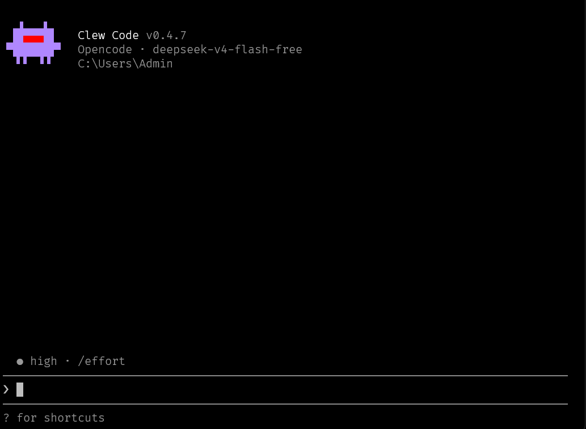

<div align="center">


### *The agent that works where you do.*

<p align="center">
  <a href="https://github.com/ClewCode/ClewCode/stargazers"></a>
  <a href="https://github.com/ClewCode/ClewCode/releases"></a>
  <a href="https://www.npmjs.com/package/clew-code"></a>
  <a href="https://github.com/ClewCode/ClewCode/actions/workflows/ci.yml"></a>
  <a href="LICENSE.md"></a>
  <a href="https://bun.sh"></a>
</p>

<p align="center">
  <a href="https://clew-code.org">Website</a> · <a href="https://clew-docs.pages.dev">Docs</a> · <a href="https://github.com/ClewCode/ClewCode/wiki">Wiki</a> · <a href="https://github.com/ClewCode/ClewCode">GitHub</a>
</p>

</div>

---

<p align="center">
  
</p>

---

Clew Code is a terminal-native AI coding agent that lives in your repo, works with your API keys, and **doesn't phone home**. It reads your code, writes files, runs commands, and talks to any LLM you bring — all on your machine, no telemetry, no vendor lock-in.

If you want a coding assistant that feels local, fast, and doesn't ship your context to a third-party server, this is it.

---

## Table of Contents

- [Prerequisites](#prerequisites)
- [Quick Install](#quick-install)
- [Getting Started](#getting-started)
- [Features](#features)
- [Use Cases](#use-cases)
- [CLI Quick Reference](#cli-quick-reference)
- [Configuration](#configuration)
- [Security](#security)
- [Documentation](#documentation)
- [Architecture](#architecture)
- [Development](#development)
- [Contributing](#contributing)
- [Star History](#star-history)
- [License](#license)

---

## Prerequisites

- **Node.js** 18+ or **Bun** 1.x (recommended for development)
- An **API key** from at least one supported provider (see [Providers docs](https://clew-docs.pages.dev/providers))
- *Optional:* Git, Playwright (for browser automation), microphone (for voice input)

---

## Quick Install

### macOS / Linux

```bash
curl -fsSL https://raw.githubusercontent.com/ClewCode/ClewCode/main/scripts/install.sh | bash
```

### Windows (PowerShell)

```powershell
irm https://raw.githubusercontent.com/ClewCode/ClewCode/main/scripts/install.ps1 | iex
```

### npm (cross-platform)

```bash
npm install -g clew-code
```

---

## Getting Started

```bash
cd your-project
clew                      # Launch the REPL
clew -p "fix the tests"   # One-shot mode
clew --resume last         # Pick up where you left off
```

First launch walks you through provider setup. After that, use `/model` to switch providers mid-session.

---

## Features

<table>
  <tr>
    <td><strong>29+ Providers</strong></td>
    <td>OpenAI, Anthropic, DeepSeek, Groq, Google, Ollama (local), and 22+ more. Switch mid-session with <code>/model</code>. No lock-in.</td>
  </tr>
  <tr>
    <td><strong>Persistent Memory</strong></td>
    <td>SQLite-backed, MiMo-inspired store with importance ranking, confidence scoring, and cross-session persistence. Auto-consolidation via Dream + Distill.</td>
  </tr>
  <tr>
    <td><strong>76+ Tools</strong></td>
    <td>Read, Write, Edit, Grep, Bash, Browser, MCP, LSP, git, web search, task management, peer coordination, media generation, voice input.</td>
  </tr>
  <tr>
    <td><strong>LAN Peer Swarm</strong></td>
    <td>Zero-config peer discovery over UDP multicast. Sync memory across machines, delegate tasks, broadcast shell commands with worktree isolation and dependency ordering.</td>
  </tr>
  <tr>
    <td><strong>MCP + Plugins + Skills</strong></td>
    <td>Model Context Protocol over stdio/SSE/WebSocket. Extend with plugins, <code>SKILL.md</code> workflows, or lifecycle hooks.</td>
  </tr>
  <tr>
    <td><strong>Enterprise Audit Logging</strong></td>
    <td>SIEM-compatible NDJSON audit trail with rotation, filtering, and level-based capture. Records tool calls, file access, and command execution.</td>
  </tr>
  <tr>
    <td><strong>Project Rules</strong></td>
    <td>Auto-observed behavioral rules scoped to your repo via <code>/rule</code>. Configured in <code>.clew/rules.json</code> — Clew reads and follows them without being reminded.</td>
  </tr>
  <tr>
    <td><strong>Ultracode Reasoning</strong></td>
    <td>Max-effort reasoning mode (<code>/ultracode</code> or <code>--effort max</code>) for complex debugging, architecture design, and multi-step refactoring.</td>
  </tr>
  <tr>
    <td><strong>Rewind / Undo</strong></td>
    <td><code>/rewind</code> restores code and/or conversation to any previous checkpoint. Integrated with structured 20%/45%/70% progress snapshots.</td>
  </tr>
  <tr>
    <td><strong>Cross-Repo Workspace</strong></td>
    <td><code>/workspace link ../other-repo</code> — edit across linked projects with full context loaded from both. Bidirectional and persistent.</td>
  </tr>
  <tr>
    <td><strong>Background Daemon</strong></td>
    <td>Task queue with lease-based concurrency, cron scheduling, dead-letter retries, memory consolidation, and cross-session task persistence.</td>
  </tr>
  <tr>
    <td><strong>Multi-Agent Architecture</strong></td>
    <td>Agents, Subagents, LAN Peers, Process Peers. Personal profile turns Clew into a command center that delegates to Codex workers.</td>
  </tr>
</table>

---

## Use Cases

| Scenario | How Clew Code Helps |
|---|---|
| **Fix failing tests** | `clew -p "Fix the failing tests and explain what was wrong"` — reads test output, diagnoses root cause, applies fixes. |
| **Refactor a module** | Point it at a file, describe the target structure. Uses multi-file edit tools, git status awareness, and checkpoint rollback on mistakes. |
| **Research a codebase** | `/research "How does auth work?"` — searches code, docs, and web, then compiles a dossier with source references. |
| **Background automation** | Run `/bg` to delegate long-running tasks (migration, lint fixes) to a background agent while you keep working in the REPL. |
| **Cross-repo changes** | `/workspace link ../other-repo` — edit across linked projects with full context from both. |

---

## CLI Quick Reference

```
-p, --prompt <text>       One-shot prompt, then exit
-c, --continue            Continue last conversation
-r, --resume [id]         Resume a session (opens picker if no id)
--model <model>           Override model (sonnet, opus, gemini-2.5-flash, etc.)
--effort <level>          Reasoning effort (low|medium|high|max)
--agent <agent>           Custom agent profile
--permission-mode <mode>  default|ask|plan|auto
--peer-share              Start as a LAN worker peer
--computer                Enable OS-level computer use (Windows only)
--debug                   Developer debug output
```

Notable slash commands: `/model`, `/effort`, `/ultracode`, `/memory`, `/rule`, `/task`, `/goal`, `/compact`, `/rewind`, `/workspace`, `/peer`, `/mcp`, `/agent`, `/plan`, `/voice`, `/research`, `/workflow`, `/skills`, `/code-review`, `/guardian`, `/bg`, `/daemon`, `/buddy`, `/doctor`, `/stats`, `/cost`, `/session`, `/diff`, `/fork`, `/theme`, and [many more](https://clew-docs.pages.dev/cli).

---

## Configuration

### Environment Variables

| Variable | Required | Description |
|---|---|---|
| `ANTHROPIC_API_KEY` | No | Anthropic Claude models |
| `OPENAI_API_KEY` | No | OpenAI GPT models |
| `DEEPSEEK_API_KEY` | No | DeepSeek models |
| `GOOGLE_API_KEY` | No | Google Gemini models |
| `GROQ_API_KEY` | No | Groq-hosted models |
| `TAVILY_API_KEY` | No | Enhanced web search provider |
| `CLEW_DISABLE_TELEMETRY` | No | Disable anonymous usage stats (`1`) |

All provider keys can also be set via the `/model` provider setup flow or in `.clew/settings.json` under `env`.

### Project Rules

Create `.clew/rules.json` in your repo to define auto-observed behavioral rules — Clew reads them at session start and follows them without being reminded. Manage them interactively with `/rule`. Disable temporarily with `/rule off`.

```json
{
  "rules": [
    "Always use the project's existing test framework for new tests",
    "Prefer named exports over default exports"
  ]
}
```

### Enterprise Audit Logging

Audit logging is opt-in and writes newline-delimited JSON events for SIEM ingestion. When enabled, Clew records tool calls, tool results/failures, file read/write access, and Bash/PowerShell command execution/results.

| Variable | Required | Description |
|---|---|---|
| `CLEW_AUDIT_LOG` | No | Enable audit logging when set to `1` |
| `CLEW_AUDIT_LOG_PATH` | No | Audit log directory, relative to the project root by default (`.clew/audit`) |
| `CLEW_AUDIT_LOG_MAX_BYTES` | No | Rotate `audit.ndjson` after this size in bytes (default: 100 MB) |
| `CLEW_AUDIT_LOG_MAX_FILES` | No | Number of audit log files to retain, including the active file (default: 10) |
| `CLEW_AUDIT_LOG_INCLUDE` | No | Comma-separated event allowlist, such as `tool.call,tool.result` |
| `CLEW_AUDIT_LOG_EXCLUDE` | No | Comma-separated event blocklist |
| `CLEW_AUDIT_LOG_MIN_LEVEL` | No | Minimum level to write: `info`, `warn`, `error`, or `audit` |
| `CLEW_AUDIT_LOG_CONSOLE` | No | Also mirror audit summaries to stderr when set to `1` |
| `CLEW_AUDIT_USER` | No | User identifier to include in each audit event |

Example:

```bash
CLEW_AUDIT_LOG=1 CLEW_AUDIT_LOG_PATH=.clew/audit bun run dev
```

---

## Security

Clew Code runs entirely on your machine. No code or context leaves your network unless you explicitly configure a remote provider or send a web fetch.

- Prompts for permission before read, write, or terminal execution
- Fine-tune auto-approve rules per workspace
- Permission scopes: default, ask, plan, auto
- Guardian system for auto-review using secondary LLM

---

## Documentation

| Guide | Description |
|---|---|
| [Quick Start](https://clew-docs.pages.dev/quick-start) | Launch the CLI and start coding |
| [Installation](https://clew-docs.pages.dev/installation) | One-liner, npm, or build from source |
| [CLI Reference](https://clew-docs.pages.dev/cli) | Full CLI options, providers, commands |
| [Configuration](https://clew-docs.pages.dev/configuration) | Settings files, hooks, permission modes |
| [MCP Guide](https://clew-docs.pages.dev/mcp) | Connect external tools and APIs |
| [Plugins](https://clew-docs.pages.dev/plugins) | Lifecycle hooks and customization |
| [Security & Permissions](https://clew-docs.pages.dev/security-permissions) | Permission scopes, guardian system |
| [Skills System](https://clew-docs.pages.dev/skills) | Automate repeatable workflows |
| [Memory System](https://clew-docs.pages.dev/memory-system) | SQLite-backed long-term memory |
| [Peer-to-Peer LAN](https://clew-docs.pages.dev/peer-to-peer) | Discover, delegate, swarm commands |
| [Architecture](https://clew-docs.pages.dev/concepts-agents-subagents-peers) | Agents, Subagents, Peers |
| [Troubleshooting](https://clew-docs.pages.dev/troubleshooting) | Common issues and fixes |

Also available on the [GitHub Wiki](https://github.com/ClewCode/ClewCode/wiki).

---

## Architecture

```
┌─ REPL ─────────────────────────────┐
│  Ink + React 19          ┌───────┐ │
│  Slash commands / skills │ Tools │ │
│  Streaming / history     └───┬───┘ │
└────────┬─────────────────────┘     │
         ▼                           │
┌─ QueryEngine ──────────────────────┘
│  Tool loop · Provider routing · Streaming
│  Context compaction · Checkpoints
└──┬────┬────┬────┬────┐
   ▼    ▼    ▼    ▼    ▼
┌────┐┌────┐┌────┐┌────┐┌──────────┐
│ MCP││LSP ││Git ││Web ││ Provider │
│    ││    ││    ││    ││ Manager  │
└────┘└────┘└────┘└────┘└──────────┘
   │         LAN            │
   ▼         ▼              ▼
┌──────┐┌──────────┐┌──────────────┐
│ SQLite││ Peer     ││ AgentRuntime │
│Memory ││ Server   ││ Task Queue   │
└──────┘└──────────┘└──────────────┘
```

---

## Development

```bash
bun run dev               # Live-reload REPL
bun run build             # Production build to dist/
bun test                  # Vitest suite
bun run check:ci          # Biome lint + format check
bun x tsc --noEmit        # TypeScript check
```

### Full Pre-Commit

```bash
bun run check:ci && bun x tsc --noEmit && bun test --bail
```

### Shadow `.js` Files

`src/` has ~410 `.js` files alongside `.ts` twins (leftover from JS → TS migration). Bun resolves `.js` import specifiers to the real `.js` file on disk — it does **not** prefer the `.ts` source. If you're making a runtime fix, check for a `.js` sibling and edit **both** files.

---

## Contributing

Contributions are welcome! See [CONTRIBUTING.md](CONTRIBUTING.md) for guidelines.

- Report bugs via [GitHub Issues](https://github.com/ClewCode/ClewCode/issues)
- Discuss ideas in [GitHub Discussions](https://github.com/ClewCode/ClewCode/discussions)
- Read [AGENTS.md](AGENTS.md) for architecture and code conventions

---

## Star History

[](https://star-history.com/#ClewCode/ClewCode&Date)

---

## License

GPL-3.0. See [LICENSE.md](LICENSE.md).

Release history in [CHANGELOG.md](CHANGELOG.md).
