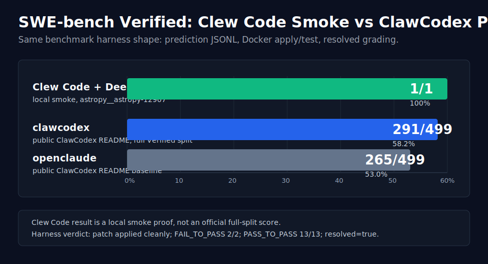

<div align="center">


# Clew Code

**The open-source, multi-provider AI coding agent — in your terminal and on your LAN.**

A local-first coding CLI that writes code, learns your preferences, coordinates across machines, and runs autonomously on your own hardware. One Bun bundle, 27 provider adapters, a persistent memory system, and a peer-to-peer LAN swarm.

[](https://github.com/ClewCode/ClewCode/stargazers)
[](https://github.com/ClewCode/ClewCode/releases)
[](https://www.npmjs.com/package/clew-code)
[](https://github.com/ClewCode/ClewCode/actions/workflows/ci.yml)
[](#license)
[](#install)
[](https://bun.sh)

[GitHub](https://github.com/ClewCode/ClewCode) · [Website](https://clew-code.org) · [Releases](https://github.com/ClewCode/ClewCode/releases) · [Wiki](https://github.com/ClewCode/ClewCode/wiki) · [Issues](https://github.com/ClewCode/ClewCode/issues)

</div>

---

## What is Clew Code?

Clew Code is an AI coding agent that lives in your terminal. Unlike single-vendor tools, it is **provider-agnostic** — bring an API key from OpenAI, Google, DeepSeek, Groq, OpenRouter, a local Ollama model, or any of 27 supported providers, and switch between them mid-session.

It is built around three ideas:

- **Local-first.** Your code, memory, and configuration stay on your machine. Ships as a single Bun bundle with no required cloud backend.
- **It remembers.** A SQLite-backed memory system learns your decisions, taste, and project structure, then budgets that context back into every prompt.
- **It scales across machines.** Discover other Clew instances on your LAN, assign tasks, sync memory, and broadcast commands to a swarm.

---

## Install

### One-liner (recommended)

Installs Bun if missing, then installs `clew-code` and drops you into a ready terminal.

**macOS / Linux**
```bash
curl -fsSL https://raw.githubusercontent.com/ClewCode/ClewCode/main/scripts/install.sh | bash
```

**Windows (PowerShell as Admin)**
```powershell
irm https://raw.githubusercontent.com/ClewCode/ClewCode/main/scripts/install.ps1 | iex
```

### npm

```bash
npm install -g clew-code
```

### From source

```bash
git clone https://github.com/ClewCode/ClewCode.git
cd ClewCode
bun install && bun run build && bun run start
```

**Requirements:** [Bun](https://bun.sh) 1.3+, Git, and at least one provider API key. Node.js 18+ is supported as a fallback runtime.

<details>
<summary><b>Platform notes</b></summary>

- **macOS** — works out of the box (Apple Silicon & Intel).
- **Linux** — no special dependencies.
- **Windows** — requires Git Bash, WSL, or PowerShell. The ComputerUse tool also works on macOS/Linux with `ENABLE_COMPUTER_USE=1`.
</details>

---

## Quick start

```bash
# Launch in any project — pick a provider on first run
cd my-project
clew
```

Set a provider key via environment variable, or configure it inside the REPL:

```bash
export OPENAI_API_KEY=sk-...
export GOOGLE_API_KEY=...
export DEEPSEEK_API_KEY=...
export GROQ_API_KEY=...
export OPENROUTER_API_KEY=...
export OLLAMA_HOST=http://localhost:11434
```

```bash
# One-shot mode (pipe-friendly)
clew -p "summarize CHANGELOG.md"

# Resume your last session
clew --resume last
```

Inside the REPL:

```text
❯ /model gpt-5.5          # switch provider/model mid-session
❯ /model ollama/llama3.3  # go fully local
❯ /status                 # provider, model, context usage
❯ /goal "tests pass"      # track + verify task completion
❯ /memory dashboard       # memory system status
❯ /peer discover          # find Clew instances on the LAN
❯ /mcp list               # connected MCP servers
❯ /help                   # list everything
```

---

## Features

### Multi-provider
**27 providers** — OpenAI, Google Gemini & Code Assist, DeepSeek, Groq, xAI (Grok), Mistral, Cohere, Perplexity, Cerebras, Moonshot (Kimi), Zhipu (GLM), NVIDIA NIM, OpenRouter, OpenCode, KiloCode, Sakana AI, Ollama, Together AI, Fireworks AI, Deep Infra, SiliconFlow, Hugging Face, Poe, DigitalOcean, Cline, and custom endpoints. Switch any time with `/model`. *(Anthropic models are reachable via OpenRouter or Cline.)*

### Memory system (MiMo-inspired)
A SQLite-backed memory store with importance ranking, confidence scoring, access tracking, and timeline logging. It auto-initializes and scans your project on first use, then injects a token-budgeted selection of memories (ranked by importance × recency × confidence) into the system prompt each turn. Durable facts are extracted automatically during context compaction, and **Dream** (7-day) + **Distill** (30-day) jobs consolidate memory over time. See it all in `/memory dashboard`.

### Peer-to-peer LAN swarm
Discover other Clew instances on the same machine (file registry) or across the LAN (UDP multicast). Assign tasks, set roles, and broadcast shell commands to every peer in parallel with `/peer swarm`. Memory syncs between peers on demand or on a cron. All endpoints are protected by a per-instance auth token, with a 10 MB request-body limit.

### Autonomous agent loop
A file-backed persistent task queue with lease-based concurrency, exponential-backoff retry, and dead-letter handling. A cron scheduler runs recurring jobs, up to 3 concurrent workers.

### Goals & verification
`/goal` tracks task completion with heuristic pre-checks (exit codes, test output, lint results), chained goals via `then`, and templates like `fix-build` and `green-tests`. When the agent declares a task done, an independent LLM verifier reviews the conversation against the goal and reports any gaps.

### 70+ built-in tools
Read, Write, Edit, Glob, Grep, Bash, WebSearch, WebFetch, Browser (Playwright), NotebookEdit, LSP, subagent dispatch (`Agent`), 17 LAN peer-coordination tools, MCP tools, `delegate` (exec/pty to external CLIs), and agent-driven memory curation.

### Extensible
- **MCP** — connect external tools over stdio, SSE (with OAuth), or in-process DirectConnect.
- **Skills, plugins, hooks** — extend without touching source. Skills via `SKILL.md`, plugins via manifest, and hooks at every lifecycle stage (PreToolUse, PostToolUse, PreBash, PostPrompt, PreAcceptEdit).
- **8 permission modes** — default, ask, plan, auto, acceptEdits, bypassPermissions, dontAsk, guardian, with granular allow/deny pattern rules.

---

## SWE-bench Verified

Clew Code ships a SWE-bench Verified evaluation harness modeled after the public
agent-comparison workflow used by projects like ClawCodex: a FastAPI wrapper
around `clew -p`, a `prepare`/`run` driver, prediction JSONL output, and optional
Docker harness execution.

<p align="center">
  
</p>

### Local Smoke Result

Clew Code has one checked local smoke result using DeepSeek on
`astropy__astropy-12907`, evaluated through the official SWE-bench Docker
harness:

| Agent | Provider / model | Scope | Resolved | Unresolved | Error |
|---|---|---:|---:|---:|---:|
| Clew Code | DeepSeek `deepseek-v4-flash` | 1-instance smoke | 1 / 1 (100%) | 0 | 0 |

Harness artifacts:

- Instance report:
  [`eval/results/swebench-smoke-astropy-deepseek-oracle-report.json`](eval/results/swebench-smoke-astropy-deepseek-oracle-report.json)
- Summary:
  [`eval/results/swebench-smoke-astropy-deepseek-oracle-summary.json`](eval/results/swebench-smoke-astropy-deepseek-oracle-summary.json)

The public [ClawCodex README](https://github.com/agentforce314/clawcodex)
reports a full Verified split comparison of `clawcodex` at 291 / 499 (58.2%)
versus `openclaude` at 265 / 499 (53.0%).
Those numbers are shown above as an external reference, not as a like-for-like
Clew Code score. No official full-split Clew Code SWE-bench score is claimed in
this repository yet. See [`eval/README.md`](eval/README.md) to run a smoke
batch, full Verified split, or side-by-side comparison with another agent.

---

## Execution layers

Clew Code runs work at several layers, each for a different job:

| Layer | What it is | Use it for |
|-------|-----------|------------|
| **Agent** | An AI worker with a prompt, model, tools, and permissions. The main chat is an agent; custom ones live in `.clew/agents/*.md`. | The session itself. |
| **Subagent** | A short-lived child launched via the `Agent` tool (e.g. read-only `Explore`). | Independent investigation, test triage, review. |
| **Teammate / Swarm** | A longer-lived agent with identity, mailbox, and task coordination. | Multi-turn collaboration between named workers. |
| **LAN Peer** | Another Clew instance on the same machine or network, reached via `/peer`. | Distributing work across machines. |
| **Process Peer** | A local worker that delegates to an external CLI (e.g. Codex) via `exec`/`pty`. | Running another coding tool as a subprocess. |

Other runtime concepts: **Plan mode** (full-access planning that persists to `.clew/plans/`), **multi-pass compaction** (recursive context compression when the window fills), and **structured checkpoints** (progress snapshots at 20/45/70% with a `notes.md` scratchpad, used for layered rebuild during compaction).

---

## Commands

<details>
<summary><strong>100+ slash commands</strong></summary>

```
/model          Switch provider or model
/status         Provider, session, context info
/doctor         Diagnostics
/context        Active context usage
/compact        Compress history + extract memories
/goal           Track and verify task completion
/memory         Memory: init, scan, rebuild, recall, feedback, dashboard, search
/peer           LAN peers: discover, send, swarm, dashboard, memory sync/auto
/daemon         Autonomous daemon dashboard
/task           Scheduled tasks
/mcp            MCP server management
/plugin         Plugin and hook management
/skills         List and manage skills
/code-review    Review changed files for bugs
/simplify       Cleanup-focused review
/guardian       Auto-review mode using a secondary LLM
/approve        Override guardian denials
/pr             GitHub PR lifecycle
/plan           Plan mode
/fork           Fork conversation into a new session
/rewind         Undo last response
/effort         Set reasoning effort
/stats          Session statistics and cost breakdown
/voice          Voice input via browser Web Speech API
/remote         WebSocket remote control
/bridge         Bridge mode config
/session        Session management
/theme          Theme switcher
/vim            Vim keybindings
/login          Sign in via Clew Gateway
/logout         Sign out
/upgrade        Check for updates
```

</details>

---

## Project layout

<details>
<summary><strong>src/ — single-entry Bun bundle</strong></summary>

```
src/
├── main.tsx              # Entry point
├── QueryEngine.ts        # Core query + tool loop
├── commands/             # Slash command implementations
├── tools/                # Built-in tools
├── services/
│   ├── ai/               # Provider manager + adapters
│   ├── mcp/              # MCP client + auth + transports
│   ├── plugins/          # Plugin hooks + marketplace
│   ├── autonomous/       # Agent loop + task queue + cron
│   ├── search/           # Web search providers
│   ├── checkpoint/       # Structured progress checkpoints
│   ├── goal/             # Goal evaluation and verification
│   ├── longTermMemory/   # Dream (7d) + Distill (30d)
│   └── compact/          # Context compression
├── peer/                 # PeerServer + PeerDiscovery
├── memory/               # MemoryDB + scanner + feedback
├── bridge/               # WebSocket bridge + relay
├── components/           # Ink terminal UI
└── hooks/                # React hooks
```

</details>

---

## Development

```bash
bun run dev           # Live reload
bun run build         # Build to dist/
bun test              # Run tests
bun x tsc --noEmit    # Type-check
bun run check:ci      # Lint + format check (Biome CI)
```

**Windows**
```powershell
Remove-Item -Recurse -Force node_modules
bun install; bun run dev
```

---

## Contributing

Contributions are welcome. Please read [CONTRIBUTING.md](CONTRIBUTING.md), [CODE_OF_CONDUCT.md](CODE_OF_CONDUCT.md), and [SECURITY.md](SECURITY.md) first.

**Good first issues**
- Add a provider adapter in `src/services/ai/`
- Write tests for untested tools
- Improve docs and examples
- Build a plugin or MCP server
- Improve Windows support

<a href="https://github.com/ClewCode/ClewCode/graphs/contributors">
  
</a>

---

## License

See [LICENSE.md](LICENSE.md). The license covers only contributor-authored modifications and original additions; it does not grant rights to third-party software, models, or trademarks.

Full version history: [CHANGELOG.md](CHANGELOG.md).
