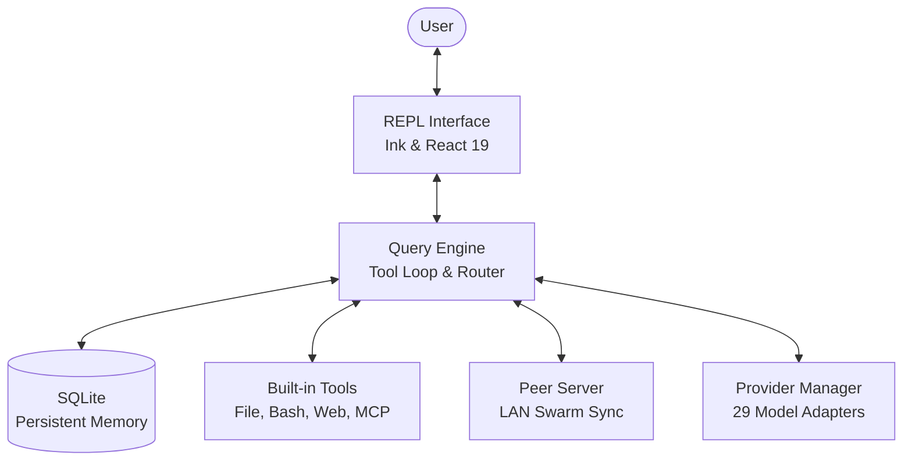

<div align="center">


# Clew Code

**A powerful, open-source, multi-provider AI coding agent for the terminal.**

A local-first coding CLI that runs on your own hardware with your own API keys — no vendor lock-in.

[](https://github.com/ClewCode/ClewCode/stargazers)
[](https://github.com/ClewCode/ClewCode/releases)
[](https://www.npmjs.com/package/clew-code)
[](https://github.com/ClewCode/ClewCode/actions/workflows/ci.yml)
[](#license)
[](https://bun.sh)

[GitHub](https://github.com/ClewCode/ClewCode) · [Website](https://clew-code.org) · [Documentation](https://clew-docs.pages.dev)

</div>

---

**Clew Code is a local-first, multi-provider AI coding CLI.** It is built to run on your own machine using your own API keys, with support for 29 LLM providers. Featuring a built-in SQLite memory system, a peer-to-peer LAN swarm capability, Model Context Protocol (MCP) tool integration, and multiple execution layers, it allows you to run agentic workflows locally or scale them across your local network.

<table>
<tr><td><b>A real terminal interface</b></td><td>Ink-based terminal REPL with autocompletion, slash commands, syntax highlighting, and inline tool stream.</td></tr>
<tr><td><b>Durable memory loop</b></td><td>SQLite-backed memory store that builds a factual profile of your project, manages context compaction, and injects relevant context into prompt cycles.</td></tr>
<tr><td><b>Peer-to-peer swarm</b></td><td>Zero-config multicast LAN discovery. Synchronize memory, assign tasks, and broadcast shell execution to multiple peer nodes.</td></tr>
<tr><td><b>Extensible tools & MCP</b></td><td>Integrates with external tools over Model Context Protocol (stdio, SSE, DirectConnect) and supports custom markdown-based skills (SKILL.md).</td></tr>
<tr><td><b>Multiple execution layers</b></td><td>Run tasks using standard Agents, isolated Subagents, teammate swarms, or delegate to external CLIs via Process Delegates.</td></tr>
<tr><td><b>Comprehensive guardrails</b></td><td>Secondary LLM guardian validation, manual approve/deny override, and multi-mode permissions (ask, auto, plan, etc.).</td></tr>
</table>

---

## Table of Contents

- [Overview](#overview)
- [Architecture](#architecture)
- [Execution Layers and Model Routing](#execution-layers-and-model-routing)
- [Advanced Architectural Subsystems](#advanced-architectural-subsystems)
- [Installation](#installation)
- [Quick Start](#quick-start)
- [Supported Providers](#supported-providers)
- [CLI Options](#cli-options)
- [Commands Reference](#commands-reference)
- [Tools Reference](#tools-reference)
- [Configuration](#configuration)
- [Project Structure](#project-structure)
- [Development Guide](#development-guide)
- [License](#license)

---

## Overview

Clew Code is an autonomous AI coding agent designed to live in your terminal. It is provider-agnostic, allowing you to bring your own API keys from OpenAI, Google, DeepSeek, Groq, OpenRouter, a local Ollama instance, or any other compatible provider, and switch between them dynamically mid-session.

Key design philosophies:
*   **Privacy & Local Control:** Your source code, active memory, and configurations remain 100% local on your machine.
*   **Context Optimization:** Built-in SQLite memory ranks context by importance and access frequency, dynamically injecting relevant history into prompts.
*   **Decentralized Scaling:** Clew instances discover each other on the local network (LAN), synchronizing memory and distributing tasks automatically.

---

## Architecture

Clew Code is divided into a clean, modular structure. Below is a high-level overview of how the CLI REPL, the Query Engine, the memory systems, and the provider adapters coordinate:



---

## Execution Layers and Model Routing

Clew Code separates execution agents (how the work is scheduled and structured) from backend model providers (the engines driving inference).

### Execution Layers

Work is distributed across four distinct layers to balance isolation, capability, and performance:

*   **Agent (Root Agent):** The main interactive session. It coordinates the overall workspace, maintains the system prompt, handles session-scoped permissions, and holds the active SQLite memory context. Custom agents can be configured dynamically or defined locally under `.clew/agents/*.md`.
*   **Subagent (Child Agent):** Short-lived, task-focused processes spawned in the background via the `AgentTool`. Subagents run concurrently in their own isolated memory contexts (often with read-only tools) to perform targeted tasks such as triaging failed unit tests, auditing changed files, or researching a subdirectory.
*   **Peer (LAN Peer Swarm):** Decentralized peer-to-peer nodes discovered automatically across the local network via UDP multicast. Peers communicate using correlation-ID brokered messages, allowing you to delegate tasks, synchronize memory databases, and broadcast shell execution to other local machines.
*   **Process Delegate (Codex / Shell Delegation):** A local subprocess wrapper that delegates tasks to external CLI tools or models using `exec`/`pty`. For example, in personal command-center mode, the main agent delegates editor file changes to a Codex worker, monitors execution, and evaluates the results before merging.

### Model Routing and Providers

Provider adapters map query payloads to their corresponding external APIs. The main intelligence engines include:

*   **Claude:** Native support for Anthropic models. In personal configurations, these models act as the master planner, supervisor, and guardian, coordinating workflows and reviewing changes made by workers.
*   **Codex:** Targeted code-generation models that run in the background (via Process Delegates) to perform precise edits, script generation, and code rewrites.
*   **OpenCode / OpenCode-Go:** Specialized open-source model configurations and endpoints optimized for code comprehension and fast inference.

---

## Advanced Architectural Subsystems

Clew Code uses several advanced subsystems to enable autonomous, safe, and context-optimized agent operations:

*   **Durable SQLite-backed Memory (MiMo):** Memory is stored in a local SQLite database with tables for `memories` (tracking importance, confidence, access counts, and type rankings) and `memory_timeline` (event tracking). Context is injected dynamically into system prompts using an `importance * recency * confidence` score. Durable facts are automatically extracted during context compaction and synced across peers. Global project guidance is maintained under `.clew/memory/` in `MEMORY.md` (project overview), `DECISIONS.md` (architectural decisions), and `TASTE.md` (style/formatting preferences).
*   **Context Compaction and Checkpoints:** When the prompt token window fills up, Clew Code runs a multi-pass context compaction loop that recursively compresses history into factual summaries. To prevent loss of active work during compaction, the supervisor captures progress snapshots as checkpoints at 20%, 45%, and 70% milestones, along with a `notes.md` scratchpad for recovery.
*   **Autonomous Task Queue and Daemon Mode:** Features a persistent task queue that operates with lease-based concurrency limits (allowing a maximum of 3 concurrent active tasks), exponential backoff retries, and a dead-letter queue (DLQ). The CLI can run in a background Daemon Mode to consume the task queue, run scheduled natural-language cron jobs, and perform memory distillation while the terminal is closed.
*   **Model Context Protocol (MCP):** A unified client interface supporting stdio, Server-Sent Events (SSE), and direct in-process WebSocket connection adapters. It dynamically fetches tool declarations and resources, extending the agent's capabilities with external server tools.
*   **Permissions and Guardian Guardrails:** Configurable permission systems restrict tool execution using policies like `ask` (confirm each edit/run), `auto` (bypass prompts), and `guardian`. Under Guardian Mode, a secondary LLM audits execution safety, blocking dangerous terminal shell operations or sensitive edits unless overridden via `/approve`.
*   **Goal Verification:** Objectives defined via `/goal` are tracked using heuristic pre-checks and verified independently by a separate LLM verification loop. The agent will not exit until the verifier confirms that all objectives in the plan are completed.

---

## Installation

### Prerequisites
*   [Bun](https://bun.sh) v1.3 or higher
*   Git installed on your system

### Via npm
```bash
npm install -g clew-code
```

### From Source
```bash
# Clone the repository
git clone https://github.com/ClewCode/ClewCode.git
cd ClewCode

# Install dependencies and build
bun install
bun run build

# Start the CLI
bun run start
```

---

## Quick Start

### 1. Launch the REPL
Navigate to any repository and run `clew`. It will guide you through setting up your first model provider:
```bash
cd my-cool-project
clew
```

### 2. Run One-Shot Commands
You can ask questions or execute tasks directly without entering the interactive shell:
```bash
clew -p "Check if all unit tests are passing and fix them if they fail"
```

### 3. Resume Previous Sessions
Resume exactly where you left off in your last coding session:
```bash
clew --resume last
```

---

## Supported Providers

Clew Code interfaces with the following model provider registries natively:

*   **openai** - OpenAI models via native SDK
*   **anthropic** - Anthropic Claude models via native SDK
*   **google** - Google Gemini models via native SDK
*   **google-assist** - Google Cloud AI and Code Assist integrations
*   **openrouter** - OpenRouter unified endpoint router
*   **deepseek** - DeepSeek API models (e.g. DeepSeek-V3, DeepSeek-R1)
*   **groq** - Groq Cloud API for ultra-fast Llama/Mixtral inference
*   **xai** - xAI Grok models
*   **mistral** - Mistral AI platform
*   **kilocode** / **opencode** / **opencode-go** - Specialized coding endpoints
*   **ollama** - Local Ollama models running on localhost
*   **together** / **fireworks** / **deepinfra** - Serverless model routers
*   **nvidia** - NVIDIA NIM API
*   **cohere** - Cohere Command models
*   **perplexity** - Perplexity Sonar search models
*   **cerebras** / **siliconflow** / **moonshot** / **zhipu** - Additional API integrations
*   **huggingface** / **poe** / **digitalocean** / **cline** - Workspace / community adapters
*   **clew-gateway** - Standard gateway auth authentication endpoint
*   **custom** - Any custom OpenAI-compatible endpoint

---

## CLI Options

Pass these arguments to the `clew` binary to customize your session:

| Flag / Option | Description |
| :--- | :--- |
| `-p, --prompt <text>` | Execute a one-shot prompt in the repository and exit immediately. |
| `-c, --continue` | Continue the most recent conversation in the current directory. |
| `-r, --resume [id]` | Resume a conversation by session ID, or open the interactive picker. |
| `--fork-session` | When resuming a session, clone it under a new ID instead of overwriting history. |
| `--from-pr [id]` | Resume a session linked to a specific GitHub PR number or URL. |
| `--model <model>` | Specify model override (e.g. `sonnet`, `opus`, `gemini-2.5-flash`). |
| `--effort <level>` | Set reasoning effort level (`low`, `medium`, `high`, or `max`). |
| `--agent <agent>` | Specify custom agent profile for the session. |
| `--permission-mode <mode>` | Specify default permission mode (`default`, `ask`, `plan`, `auto`, etc.). |
| `--add-dir <dirs...>` | Grant tool access to additional directories outside the workspace. |
| `--ide` | Automatically connect to the local IDE on startup if available. |
| `--session-id <uuid>` | Force a specific session ID for the active workspace. |
| `-n, --name <name>` | Set display name for this session (shown in /resume and terminal title). |
| `--peer-name <name>` | Set display name for local LAN peer discovery. |
| `--peer-share` | Automatically launch this instance as a sharing worker peer on startup. |
| `--computer` | Enable OS computer-use tool (Windows only). |
| `-d, --debug` | Enable developer debugging output. |
| `--verbose` | Override verbose logging setting from config. |

---

## Commands Reference

Type these slash commands directly inside the interactive REPL:

### Core Commands
*   `/model <name>` - Switch the provider or LLM model mid-session.
*   `/status` - Check active provider, remaining context, and session metrics.
*   `/doctor` - Run environment diagnostics and connectivity checks.
*   `/context` - Inspect active context tokens and compaction boundaries.
*   `/plan` - Enter/exit plan mode to map out large-scale refactors.
*   `/rewind` - Undo the last user prompt and assistant response.
*   `/effort` - Adjust reasoning effort parameter.
*   `/stats` - View session statistics and token usage.
*   `/theme` - Switch between dark, light, and custom terminal UI themes.
*   `/vim` - Toggle Vim keybindings in the REPL editor.

### Memory & Learning
*   `/memory init` - Initialize a clean SQLite memory database for the project.
*   `/memory scan` - Scan the active codebase to build code hierarchy memory.
*   `/memory dashboard` - View memory statistics, confidence scores, and facts.
*   `/skills` - List and manage active custom skills defined in `.clew/skills/`.

### Swarm & LAN Peers
*   `/peer discover` - Search the LAN for active Clew nodes.
*   `/peer swarm <cmd>` - Broadcast a shell command to all discovered peers.
*   `/peer dashboard` - Open the visual coordination panel for peer status.

---

## Tools Reference

The agent has access to the following built-in tools based on active permission modes:

### File and Terminal I/O
*   `FileReadTool` / `FileWriteTool` / `FileEditTool` - Read, write, and modify files.
*   `GlobTool` / `GrepTool` - Search files and directory structures.
*   `BashTool` - Execute command-line commands in the local shell.
*   `PowerShellTool` - Execute PowerShell scripts natively (Windows only).

### Web Access and Scraping
*   `WebSearchTool` - Query web search engines.
*   `WebFetchTool` - Retrieve raw markdown/HTML from public URLs.
*   `BrowserTool` - Automate headless Chrome using Playwright.

### Task Management
*   `TaskCreateTool` / `TaskGetTool` / `TaskUpdateTool` / `TaskListTool` - Track workflow task checklists.
*   `TaskStopTool` / `TaskOutputTool` - Manage long-running tasks.
*   `GoalTool` - Verify steps against overall task targets.

### Advanced Capabilities
*   `AgentTool` - Spawns a subagent to research, write tests, or triage issues.
*   `LSPTool` - Query local Language Server Protocol diagnostics.
*   `ProcessDelegateTool` - Delegate prompts to external CLI models or Codex.
*   `MemoryFeedbackTool` - Update project memories, decisions, and preferences.

---

## Configuration

Clew Code configuration files reside in `~/.clew/` on your system:

*   `~/.clew/settings.json` - Shared global settings (models, defaults, formatting).
*   `~/.clew/settings.local.json` - Environment-specific private overrides.
*   `~/.clew/memory/` - Text files containing `MEMORY.md`, `DECISIONS.md`, and `TASTE.md`.

Set these environment variables to authenticate with providers:

| Variable | Description |
| :--- | :--- |
| `OPENAI_API_KEY` | Authentication key for OpenAI models |
| `GOOGLE_API_KEY` | Authentication key for Google Gemini / Code Assist |
| `DEEPSEEK_API_KEY` | Authentication key for DeepSeek models |
| `GROQ_API_KEY` | Authentication key for Groq Cloud API |
| `OPENROUTER_API_KEY` | Authentication key for OpenRouter API |
| `OLLAMA_HOST` | Custom address for local Ollama server (e.g., `http://localhost:11434`) |

---

## Project Structure

```text
src/
├── main.tsx              # CLI entry point & flag parser
├── replLauncher.tsx      # Boots the Ink/React 19 REPL
├── QueryEngine.ts        # Streaming message/tool loop
├── query.ts              # Non-streaming variant
├── commands/             # Slash commands (prompt, local, local-jsx types)
├── tools/                # 70+ tools (File I/O, Bash, Browser, Peer, MCP, etc.)
├── peer/                 # LAN P2P: UDP multicast discovery, HTTP heartbeat
├── memory/               # SQLite-backed memory with importance/recency ranking
├── services/             # 36+ services (AI, MCP, autonomous, compact, etc.)
├── skills/               # SKILL.md loader (Claude Code compatible)
├── plugins/              # Plugin loader, registry, marketplace
├── agentRuntime/         # Background agent orchestration
└── remote/               # WebSocket server, auth tokens, NAT relay (Bridge v2)
```

Full architecture reference in **[AGENTS.md](AGENTS.md)**.

---

## Development Guide

Run development commands from the repository root using **Bun**:

```bash
bun run dev              # Live-reload REPL (Voice, Transcript, Chicago flags on)
bun run dev:channels     # Launch dev server with development channels
bun test                 # Run the test suite via Vitest
bun test --bail          # Run tests and stop on the first failure
bun run lint             # Run Biome linter with auto-fix
bun run format           # Run Biome formatter with auto-fix
bun x tsc --noEmit       # Compile-free TypeScript validation
```

### Pre-commit check

```bash
bun run check:ci && bun x tsc --noEmit && bun test --bail
```

### Knowledge graph

This project has a pre-built knowledge graph for codebase exploration:

```bash
graphify query "<question>"   # Ask questions about the codebase
graphify path "<A>" "<B>"     # Trace relationships between symbols
graphify explain "<concept>"  # Focused explanation of a concept
graphify update .             # Refresh after code changes (AST-only, no API cost)
```

### Important: `.js` shadows `.ts`

`src/` has ~188 committed `.js` files next to `.ts`/`.tsx` twins (JS-to-TS migration in progress). Bun resolves `.js` import specifiers to the real `.js` file — if you edit only the `.ts` file, your change won't run at runtime. Check for a `.js` sibling and edit both.

Full developer reference in **[AGENTS.md](AGENTS.md)**.

---

## License

Clew Code is licensed under the **GPL-3.0 License**. See [LICENSE.md](LICENSE.md) for details.
Full release history is available in [CHANGELOG.md](CHANGELOG.md).
