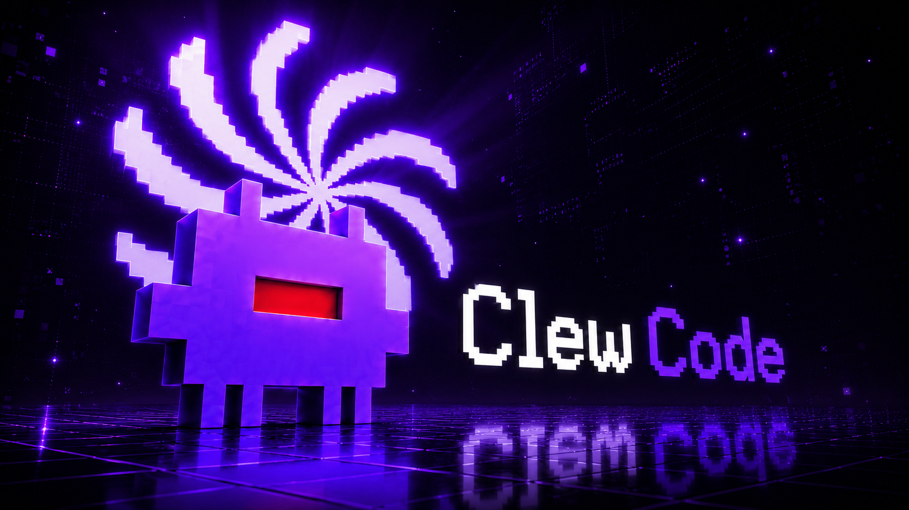

<p align="center">
  
</p>

<p align="center">
  <strong>Sprache:</strong>
  <a href="../README.md">English</a> ·
  <a href="README.zh.md">中文</a> ·
  <a href="README.th.md">ไทย</a> ·
  <a href="README.ja.md">日本語</a> ·
  <a href="README.ko.md">한국어</a> ·
  <a href="README.es.md">Español</a> ·
  <a href="README.fr.md">Français</a> ·
  <a href="README.de.md"><strong>Deutsch</strong></a> ·
  <a href="README.pt.md">Português</a> ·
  <a href="README.vi.md">Tiếng Việt</a> ·
  <a href="README.id.md">Bahasa Indonesia</a> ·
  <a href="README.ru.md">Русский</a> ·
  <a href="README.hi.md">हिन्दी</a>
</p>

# Clew 🪽

Clew ist ein inoffizielles, forschungsorientiertes CLI für KI-gestützte Softwareentwicklung.

Dieses Projekt ist eine quellcodebasierte Rekonstruktion und Erweiterung, entwickelt für lokale Entwicklung, Debugging, selbstgehostete Workflows und die freie Wahl des KI-Anbieters.

Dieses Repository ist kein offizielles Produkt, keine Distribution, kein Partnerprojekt und keine unterstützte Implementierung.

> **Haftungsausschluss:** Dieses Projekt ist mit keinem Dritten verbunden, wird nicht von ihm unterstützt, gesponsert oder genehmigt. Bitte lesen Sie [LICENSE.md](../LICENSE.md), bevor Sie dieses Repository verwenden, modifizieren, weiterverteilen oder bereitstellen.

## Was dieses Projekt bietet

| Bereich                | Beschreibung                                                                                                               |
| ---------------------- | -------------------------------------------------------------------------------------------------------------------------- |
| Quellbau-CLI           | Eine Bun/TypeScript-Terminalanwendung, die lokal gebaut, getestet, inspiziert und modifiziert werden kann                  |
| Multi-Anbieter-Routing | Unterstützung mehrerer KI-Anbieter durch Adapter und Modellauswahlbefehle                                                   |
| Entwicklerwerkzeuge    | Befehle für Kontextinspektion, Code-Review, Vereinfachung, Recherche, Plugins, MCP, LSP, Sitzungen und Hintergrundworkflows |
| Lokale Erweiterbarkeit | Unterstützung für Plugins, Hooks, Skills, benutzerdefinierte Tools, geplante Aufgaben und projektebene Konfiguration       |
| Forschungsnutzung      | Transparente Codebasis zum Studium von KI-Coding-Agent-Architektur, Terminal-UX, Anbieter-Routing und Tool-Ausführung      |

## Funktionen

Clew läuft direkt in Ihrem Terminal. Es kann lokale Codebasen inspizieren und bearbeiten, Shell-Befehle mit Berechtigungen ausführen, Modellanbieter wechseln und länger laufende Agenten-Workflows koordinieren.

Hauptfunktionen:

* **Multi-Anbieter-KI-Routing** — Unterstützt Anthropic, OpenAI, Google Gemini, OpenRouter, Ollama, GitHub Copilot und OpenAI-kompatible Endpunkte
* **Laufzeit-Modellwechsel** — Verwenden Sie `/model`, um während einer Sitzung das Modell oder den Anbieter zu wechseln
* **Tool-gesteuerte Workflows** — Dateien lesen, suchen, bearbeiten und schreiben; Shell-Befehle ausführen; LSP abfragen; MCP-Tools ausführen; Browser-Automatisierung integrieren
* **Plugin-Hooks** — Hooks für Prompts, Shell-Ausführung, Tool-Aufrufe, Nachrichtenanzeige, Sitzungsstart und Dateibearbeitungsaktionen
* **Dynamische Skills** — Laden von Skills aus dem Projekt und `.claude/skills/`
* **Code-Review-Tools** — `/code-review --fix` zum Prüfen und Anwenden von Änderungen, `/simplify` zum Bereinigen
* **Guardian Auto-Review** — `/guardian` leitet Berechtigungsanfragen an einen LLM-Reviewer mit Schutzschalter weiter
* **PR-Verwaltung** — `/pr create`, `list`, `view`, `review`, `merge`, `status`
* **Anbieterunabhängige Fernsteuerung** — `/remote` für WebSocket-basiertes CLI-Sharing
* **Modellauswahl** — Globale oder sitzungsbezogene Modellauswahl
* **Plugin-Marktplatz** — `skipLfs`-Unterstützung für Plugin-Quellen
* **Lokale Recherche** — `/research <query>` für Recherche mit lokalem Web-Scraping
* **Agenten und Supervisor** — Verwaltung von Hintergrundagenten, mehrstufigen Workflows, Zusammenfassungen, Aufgabenstatus, Genehmigungen und Sitzungszustand
* **Hintergrund-Shell-Befehle** — Führen Sie lange Befehle mit `!bg <command>` aus
* **Geplante Aufgaben** — Erstellen Sie einmalige oder wiederkehrende Aufgaben mit `/task`
* **Sitzungen und Bridge-Modus** — Speichern, Wiederherstellen und Verbinden von Sitzungen für Remote-Workflows

## Schnellstart

### Globale Installation

```bash
npm install -g clew-code
```

Oder:

```bash
bun install -g clew-code
```

Führen Sie die CLI im Projektverzeichnis aus:

```bash
clew
```

> Der globale Starter erfordert, dass Bun auf dem System installiert ist

### Aus dem Quellcode ausführen

```bash
git clone https://github.com/ClewCode/ClewCode.git
cd ClewCode

bun install
bun run build
bun run start
```

Entwicklungsmodus:

```bash
bun run dev
```

## Systemanforderungen

- Bun 1.3 oder höher
- Node.js 18 oder höher
- Git
- Windows, macOS, Linux oder WSL2
- API-Schlüssel von mindestens einem unterstützten Anbieter (nicht erforderlich bei Verwendung eines lokalen Anbieters wie Ollama)

## Anbieterkonfiguration

Setzen Sie Anbieterschlüssel in der Shell oder einer `.env`-Datei:

```bash
export ANTHROPIC_API_KEY=sk-ant-...
export OPENAI_API_KEY=sk-...
export GOOGLE_API_KEY=...
export OPENROUTER_API_KEY=sk-or-...
export OLLAMA_HOST=http://localhost:11434
```

Wechseln Sie während einer Sitzung das Modell/den Anbieter:

```text
/model
/model list
/model openai/gpt-4o
/model google/gemini-2.5-pro
```

Anbieterdokumentation:

```text
docs/providers.html
```

## Häufige Befehle

```text
/model        Modell oder Anbieter wechseln
/taste        Lernpräferenzmenü öffnen
/status       Anbieter-, Sitzungs- und Kontextstatus anzeigen
/doctor       Diagnose ausführen
/context      Kontextnutzung überprüfen
/compact      Konversationsverlauf komprimieren
/mcp          MCP-Server verwalten
/code-review  Code-Änderungen überprüfen
/simplify     Bereinigungsorientierte Überprüfung
/plugin       Plugins und Hooks verwalten
/bridge       Bridge-Modus einrichten
/agent        Hintergrund-Agenten-Workflows verwalten
/daemon       Autonomes Daemon-Dashboard starten
/task         Geplante Aufgaben erstellen oder verwalten
```

Geben Sie `/` in der CLI ein, um die vollständige Befehlsliste anzuzeigen.

## Geplante Aufgaben

Das System für geplante Aufgaben ist über `/task` verfügbar.

```text
/task
```

Beispiele:

```text
/task
Name: Serverprüfung
Schedule: Daily
Time: 20:00
Prompt: Status der lokalen Server überprüfen
Storage: Durable
```

```text
/task
Name: Commit-Erinnerung
Schedule: In N minutes
Delay: 10
Prompt: Mich an das Commit erinnern
Storage: Session-only
```

Aufgabenverhalten:

* Dauerhafte Aufgaben werden in `.claude/scheduled_tasks.json` gespeichert
* Sitzungsbezogene Aufgaben laufen nur während der aktiven Sitzung
* Wiederkehrende Aufgaben verwenden die standardmäßige 5-Feld-Cron-Syntax
* Einmalige Aufgaben werden nach der Ausführung entfernt
* Die lokale Zeitzone des Computers wird für die geplante Ausführung verwendet

## Taste

Taste ist eine lokale Präferenzlern-Laufzeit. Sie lernt aus Akzeptanz-, Ablehnungs-, Bearbeitungs-, Test-, Lint- und manuellen Regeln. Sie kombiniert symbolische Regeln, semantische Präferenzbewertung und kontextuelle Banditenoptimierung, um Clew an Ihren Codierstil anzupassen. Sie führt kein Fine-Tuning des Basis-LLM durch.

```text
/taste                Interaktives Menü öffnen
/taste learn <rule>   Manuelle Regel hinzufügen
/taste forget <id>    Regel entfernen
/taste profile        Alle Regeln anzeigen
/taste events         Aktuelle Ereignisse anzeigen
/taste decay          Vertrauensabfall anwenden
/taste eval           Selbstbewertung ausführen
/taste export         Hochvertrauensregeln exportieren
/taste import <file>  Regeln aus Datei importieren
/taste on             Taste aktivieren
/taste off            Taste deaktivieren
```

### Hauptfunktionen

- **Interaktives Menü** — Pfeiltasten-navigierbarer Dialog mit 11 Aktionen, Spinner-Laden für asynchrone Vorgänge
- **Bearbeitungsvalidierung** — Scannt Bearbeitungen während Berechtigungsanfragen, warnt bei Verstößen gegen erlernte Regeln
- **Live-Neuladen der Konfiguration** — Abonniert `settings.json`-Änderungen über `subscribeToSettingsChanges()`
- **Statuszeile** — `ⓘ taste: N rules` angezeigt in PromptInputFooter
- **Prompt-Injektion** — Injiziert `<clew_taste>` XML-Block mit bis zu 8 relevanten Regeln in den System-Prompt
- **Signalerfassung** — Fire-and-Forget-Signale aus PermissionContext und Tool-Ausführung
- **Abfall-Engine** — Allmähliche Vertrauensreduzierung für ungenutzte Regeln (halbwertszeitbasiert, Standard 30 Tage)

Vollständige Dokumentation unter [docs/taste.html](../docs/taste.html).

## Entwicklung

```bash
bun run dev              # Entwicklungsmodus starten
bun run start            # CLI aus dem Quellcode ausführen
bun run build            # In dist/ kompilieren
bun test                 # Tests ausführen
bun x tsc --noEmit       # Typenüberprüfung
bun run lint:check       # Biome-Lint-Regeln prüfen
bun run format:check     # Biome-Formatierung prüfen
bun run check:ci         # Biome-CI-Validierung ausführen
```

Entwicklungsdienstprogramme:

```bash
bun run preload <module>     # Modulkontext vorladen
bun run session <command>    # Sitzungskontext speichern, auflisten oder wiederherstellen
bun run codegraph            # Modulabhängigkeitsgraphen generieren
bun run ast-grep -- <args>   # Strukturelle AST-Suche oder -Umschreibung ausführen
```

## Projektstruktur

```text
src/
├── main.tsx              # Terminal-UI-Bootstrap und Hauptschleife
├── query.ts              # Abfrageverarbeitung und System-Prompt-Logik
├── QueryEngine.ts        # Abfrageorchestrierung, Caching, Deduplizierung und Ratengrenzen
├── agentRuntime/         # Agentenorchestrierung und persistente Ausführungsspeicher
├── commands/             # Slash-Befehlimplementierungen
├── tools/                # Integrierte Entwicklerwerkzeuge
├── services/
│   ├── ai/               # Anbieterverwaltung, Adapter, Normalisierer und providers.json
│   ├── mcp/              # Model Context Protocol-Clients
│   ├── plugins/          # Plugin-Lebenszyklus-Hooks und Interceptors
│   ├── tools/            # Tool-Ausführungsdienst
│   ├── lsp/              # Language Server Protocol-Integration
│   ├── Supervisor/       # Hintergrund-Agenten-Supervisor
│   └── SessionMemory/    # Persistenter Sitzungsspeicher
├── skills/               # Dynamischer Skill-Lader
├── cli/                  # Terminal-UI-Kontexte
├── components/           # Terminal-UI-Komponenten
├── bridge/               # WebSocket-Brücke
├── coordinator/          # Multi-Agenten-Koordinator
├── keybindings/          # Tastaturkürzelzuordnungen
├── state/                # Reaktive Speicher
└── vim/                  # Vim-ähnlicher Navigationsmodus
```

## Architektur

```text
Terminal UI
  -> Befehlsregister und Tastenkombinationen
  -> Anbieterverwaltung und KI-Adapter
  -> Abfrage-Engine und Streaming-Schleifen
  -> Tool-Ausführungsdienst
  -> Plugins, MCP, LSP, Agenten, Sitzungsspeicher und Brücke
```

## Dokumentation

* [Installation](../docs/installation.html)
* [Schnellstart](../docs/quick-start.html)
* [Konfiguration](../docs/configuration.html)
* [KI-Anbieter](../docs/providers.html)
* [Modelle](../docs/models.html)
* [Befehle](../docs/commands.html)
* [Werkzeuge](../docs/tools.html)
* [Plugins](../docs/plugins.html)
* [Skills](../docs/skills.html)
* [Architektur](../docs/architecture.html)
* [Berechtigungsmodell](../docs/permission-model.html)
* [Bridge-Modus](../docs/features/bridge-mode.html)
* [Fehlerbehebung](../docs/troubleshooting.html)
* [Bewertungen](../docs/features/evals.html)
* [Taste](../docs/taste.html)

## Debugging

```bash
DEBUG=1 bun run src/main.tsx
DEBUG=provider:anthropic bun run src/main.tsx
```

## Plattformhinweise

### Windows

```powershell
Remove-Item -Recurse -Force node_modules
bun install
bun run dev
```

Eine vorkompilierte `ripgrep`-Binärdatei für Windows kann unter folgendem Pfad enthalten sein:

```text
src/utils/vendor/ripgrep/x64-win32/rg.exe
```

## Mitwirken

Lesen Sie diese Dateien, bevor Sie einen Beitrag leisten:

* [CONTRIBUTING.md](../CONTRIBUTING.md)
* [CODE_OF_CONDUCT.md](../CODE_OF_CONDUCT.md)
* [SECURITY.md](../SECURITY.md)
* [LICENSE.md](../LICENSE.md)

Reichen Sie keinen proprietären Code, kopierte Quellen, durchgesickertes Material, Anmeldedaten, private Schlüssel oder Inhalte ein, für die Sie keine Lizenzrechte besitzen.

## Sicherheit

Öffnen Sie keine öffentlichen Issues für Sicherheitslücken.

Nutzen Sie den in [SECURITY.md](../SECURITY.md) beschriebenen privaten Meldeweg.


## Changelog

<details>
<summary><strong>0.2.4 — 2026-06-08</strong></summary>

- **Peer-to-peer** — LAN discovery, task delegation, 14 AI tools
- **Taste tools** — taste_learn, taste_forget, taste_profile, taste_suggest
- **Autonomous agents** — agent loop, supervisor, task queue, Loop Lock
- **Workflow Rainbow** — per-character gradient

</details>

[Full changelog](../CHANGELOG.md)

## Lizenz

Siehe [LICENSE.md](../LICENSE.md).

Nur vom Mitwirkenden erstellte Änderungen und ursprüngliche Ergänzungen sind wie in `LICENSE.md` beschrieben lizenziert.
