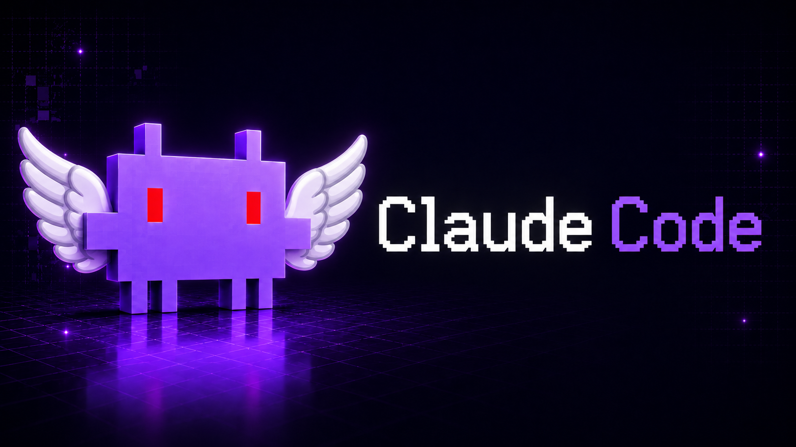

<p align="center">
  
</p>

<p align="center">
  <strong>ภาษา:</strong>
  <a href="../README.md">English</a> ·
  <a href="README.zh.md">中文</a> ·
  <a href="README.th.md"><strong>ไทย</strong></a> ·
  <a href="README.ja.md">日本語</a> ·
  <a href="README.ko.md">한국어</a> ·
  <a href="README.es.md">Español</a> ·
  <a href="README.fr.md">Français</a> ·
  <a href="README.de.md">Deutsch</a> ·
  <a href="README.pt.md">Português</a> ·
  <a href="README.vi.md">Tiếng Việt</a> ·
  <a href="README.id.md">Bahasa Indonesia</a> ·
  <a href="README.ru.md">Русский</a> ·
  <a href="README.hi.md">हिन्दी</a>
</p>

# Clew

Clew เป็น CLI สำหรับช่วยพัฒนาซอฟต์แวร์ด้วย AI แบบไม่เป็นทางการ

โปรเจกต์นี้เป็นงาน rebuild และ extension จากซอร์ส เพื่อการวิจัย การพัฒนาในเครื่อง การดีบัก การใช้งานแบบ self-hosted และการเลือก provider ได้หลายแบบ

โปรเจกต์นี้ไม่ใช่ผลิตภัณฑ์ทางการ ไม่ใช่ distribution ที่ได้รับอนุญาต

> **ข้อจำกัดความรับผิดชอบ:** โปรเจกต์นี้ไม่มีส่วนเกี่ยวข้องกับบุคคลที่สามใดๆ โปรดอ่าน [LICENSE.md](../LICENSE.md) ก่อนใช้งาน แก้ไข แจกจ่าย หรือนำโปรเจกต์นี้ไป deploy

## สิ่งที่โปรเจกต์นี้มอบให้

| ด้าน                   | รายละเอียด                                                                                                    |
| ---------------------- | ------------------------------------------------------------------------------------------------------------- |
| Source-built CLI       | แอปเทอร์มินัล Bun/TypeScript ที่ build, test, inspect และแก้ไขในเครื่องได้                                    |
| Multi-provider routing | รองรับหลาย AI provider ผ่าน adapter และคำสั่งเลือกโมเดล                                                       |
| Developer tooling      | มีคำสั่งสำหรับ context, code review, simplify, research, plugins, MCP, LSP, sessions และ background workflows |
| Local extensibility    | รองรับ plugins, hooks, skills, custom tools, scheduled tasks และ config ระดับโปรเจกต์                         |
| Research use           | ใช้ศึกษา architecture ของ AI coding agent, terminal UX, provider routing และ tool execution                   |

## ฟีเจอร์

| ฟีเจอร์ | รายละเอียด |
|---|---|
| **Multi-provider** | Anthropic, OpenAI, Gemini, OpenRouter, Ollama, NVIDIA, DeepSeek, Copilot และ endpoint ที่เข้ากับ OpenAI ได้ สลับด้วย `/model` |
| **Coding tools** | File read/edit/write, shell exec, LSP, MCP, `Glob`, `Grep`, `WebSearch`, `WebFetch`, browser automation |
| **Code review** | `/code-review --fix`, `/simplify`, `/pr create/list/view/review/merge` |
| **Agents** | Background runtime พร้อม supervisor, multi-step workflows, approvals, แสดงสถานะใน footer |
| **Peer-to-peer** | ค้นพบ peers บน LAN (UDP multicast), มอบหมายงาน, ตั้งชื่อ/role, 14 AI tools สำหรับประสานงานอัตโนมัติ |

| **Daemon & loop** | โหมดอัตโนมัติ 24/7 (`/loop`), task queue, auto-scheduling, health checks |
| **Plugins & hooks** | Pre/post tool hooks, dynamic skills (`.claude/skills/`), marketplace |
| **Bridge & relay** | WebSocket remote control, relay server สำหรับ cross-network |
| **Research** | Multi-source research pipeline: plan → collect → extract → report |
| **Permission modes** | Default, Auto, Plan, YOLO หลายระดับ — ควบคุมการรัน tool |
| **Sessions** | บันทึก, กู้คืน, compact, rewind — จัดการ conversation เต็มรูปแบบ |
| **Compact** | KiloCompact: log snipping, failed-state consolidation, semantic pruning |

## เริ่มต้นอย่างรวดเร็ว

### ติดตั้งแบบ global

```bash
npm install -g clew-code
```

หรือ:

```bash
bun install -g clew-code
```

รัน CLI ในไดเรกทอรีโปรเจกต์:

```bash
clew
```

> global launcher ต้องมี Bun ติดตั้งอยู่ในเครื่อง

ถ้าตั้ง alias ไว้ใน `package.json` จะรันได้อีกชื่อด้วย:

```bash
clewcode
```

### รันจากซอร์ส

```bash
git clone https://github.com/ClewCode/ClewCode.git
cd ClewCode

bun install
bun run build
bun run start
```

สำหรับโหมดพัฒนา:

```bash
bun run dev
```

## ความต้องการของระบบ

* Bun 1.3 ขึ้นไป
* Node.js 18 ขึ้นไป
* Git
* Windows, macOS, Linux หรือ WSL2
* API key จาก provider ที่รองรับอย่างน้อยหนึ่งตัว เว้นแต่ใช้ local provider เช่น Ollama

## ตั้งค่า Provider

ตั้งค่า provider keys ใน shell หรือไฟล์ `.env`

```bash
export ANTHROPIC_API_KEY=sk-ant-...
export OPENAI_API_KEY=sk-...
export GOOGLE_API_KEY=...
export OPENROUTER_API_KEY=sk-or-...
export OLLAMA_HOST=http://localhost:11434
```

สลับ model หรือ provider ระหว่าง session:

```text
/model
/model list
/model openai/gpt-4o
/model google/gemini-2.5-pro
```

เอกสาร provider:

```text
../docs/providers.html
```

## คำสั่งที่ใช้บ่อย

<details>
<summary><strong>16 คำสั่ง</strong></summary>

```text
/model        สลับ model หรือ provider
/status       ดูสถานะ provider, session และ context
/doctor       รัน diagnostics
/context      ตรวจการใช้ context
/compact      บีบอัด conversation history
/mcp          จัดการ MCP servers
/code-review  ตรวจโค้ดที่เปลี่ยน
/simplify     cleanup-focused review
/plugin       จัดการ plugins และ hooks
/bridge       ตั้งค่า bridge mode
/agent        จัดการ background agent workflows
/swarm         ค้นหาและประสานงาน peers บน LAN
/remote       WebSocket remote control
/loop         เปิดโหมด agent อัตโนมัติ 24/7
/daemon       เปิด autonomous daemon dashboard
/task         สร้างหรือจัดการ scheduled tasks
```

</details>

พิมพ์ `/` ใน CLI เพื่อดูรายการคำสั่งทั้งหมด


## Peer-to-Peer — ทำงานร่วมกันบน LAN

ค้นพบ peers บน LAN ผ่าน UDP multicast มอบหมายงาน ตั้งชื่อ/role และให้ AI ประสานงานอัตโนมัติ

<details>
<summary><strong>คำสั่งและ AI tools</strong></summary>

```text
/swarm                  เปิดเมนูแบบโต้ตอบ
/swarm share            เริ่มแชร์เป็น worker
/swarm share stop       หยุดแชร์
/swarm discover         สแกน LAN หา peers
/swarm join <port>      เชื่อมต่อกับ peer
/swarm list             แสดง peers ที่เชื่อมต่อ
/swarm todo <peer> <t>  มอบหมายงาน
/swarm todos            ดูงานที่ได้รับ
/swarm todo done <id>   ทำเครื่องหมายว่างานเสร็จ
/swarm name <name>      ตั้งชื่อ display
/swarm role <role>      ตั้ง role (builder, tester, etc.)
/swarm inbox            ดูข้อความที่ยังไม่ได้อ่าน
/swarm spawn [opts]     เปิด peer shell ใหม่
/swarm help             แสดงคำสั่งทั้งหมด
```

**AI tools (14):** `peer_discover`, `peer_join`, `peer_send_task`, `peer_send_message`, `peer_run`, `peer_broadcast`, `peer_ping`, `peer_disconnect`, `peer_list_tasks`, `peer_list_roles`, `peer_list_messages`, `peer_set_name`, `peer_set_role`, `peer_share`

</details>

ดูรายละเอียดที่ [docs/features/peer.html](../docs/features/peer.html)

## Scheduled Tasks

ระบบ scheduled task ใช้ผ่าน `/task`

```text
/task
```

ตัวอย่าง:

```text
/task
Name: ตรวจสอบเซิร์ฟเวอร์
Schedule: Daily
Time: 20:00
Prompt: ตรวจสอบสถานะเซิร์ฟเวอร์
Storage: Durable
```

```text
/task
Name: เตือน commit
Schedule: In N minutes
Delay: 10
Prompt: เตือนให้ commit โค้ด
Storage: Session-only
```

พฤติกรรมของ task:

* Durable tasks ถูกบันทึกที่ `.claude/scheduled_tasks.json`
* Session-only tasks ทำงานเฉพาะ session ปัจจุบัน
* Recurring tasks ใช้ cron syntax แบบ 5 fields
* One-shot tasks ถูกลบหลังจากรันเสร็จ
* ใช้ timezone ของเครื่องสำหรับการรันตามเวลา

## การพัฒนา

```bash
bun run dev              # โหมด dev พร้อม watch
bun run start            # รัน CLI จากซอร์ส
bun run build            # build ไปที่ dist/
bun test                 # รัน tests
bun x tsc --noEmit       # type check
bun run lint:check       # ตรวจ Biome lint
bun run format:check     # ตรวจ Biome formatting
bun run check:ci         # รัน Biome CI validation
```

Developer utilities:

```bash
bun run preload <module>     # preload module context
bun run session <command>    # save, list หรือ restore session context
bun run codeindex <command>  # index และค้นหา codebase
bun run codegraph            # สร้าง module dependency graph
bun run ast-grep -- <args>   # ค้นหาหรือ rewrite ด้วย AST
```

## โครงสร้างโปรเจกต์

```text
src/
├── main.tsx              # Terminal UI bootstrap และ main loop
├── query.ts              # Query processing และ system prompt logic
├── QueryEngine.ts        # Query orchestration, caching, dedupe และ rate limits
├── agentRuntime/         # Agent orchestration และ persistent run stores
├── commands/             # Slash command implementations
├── tools/                # Built-in developer tools
├── services/
│   ├── ai/               # Provider manager, adapters, normalizers และ providers.json
│   ├── mcp/              # Model Context Protocol clients
│   ├── plugins/          # Plugin lifecycle hooks และ interceptors
│   ├── tools/            # Tool execution service
│   ├── lsp/              # Language Server Protocol integration
│   ├── Supervisor/       # Background agent supervisor
│   └── SessionMemory/    # Persistent session memory
├── skills/               # Dynamic skill loader
├── cli/                  # Terminal UI contexts
├── components/           # Terminal UI components
├── bridge/               # WebSocket bridge
├── peer/                 # การค้นพบ peers บน LAN
├── coordinator/          # Multi-agent coordinator
├── keybindings/          # Keyboard shortcut mappings
├── state/                # Reactive stores
└── vim/                  # Vim-like navigation mode
```

## สถาปัตยกรรม

```text
Terminal UI
  -> Command registry และ keybindings
  -> Provider manager และ AI adapters
  -> Query engine และ streaming loops
  -> Tool executor service
  -> Plugins, MCP, LSP, agents, session memory และ bridge
```

## เอกสาร

* [การติดตั้ง](../docs/installation.html)
* [เริ่มต้นอย่างรวดเร็ว](../docs/quick-start.html)
* [การตั้งค่า](../docs/configuration.html)
* [AI Providers](../docs/providers.html)
* [Models](../docs/models.html)
* [Commands](../docs/commands.html)
* [Tools](../docs/tools.html)
* [Plugins](../docs/plugins.html)
* [Skills](../docs/skills.html)
* [Architecture](../docs/architecture.html)
* [Permission Model](../docs/permission-model.html)
* [Peer-to-Peer](../docs/features/peer.html)
* [Bridge Mode](../docs/features/bridge-mode.html)
* [SearXNG Search](../docs/features/searxng-search.html)
* [Troubleshooting](../docs/troubleshooting.html)
* [Evals](../docs/features/evals.html)


## การดีบัก

```bash
DEBUG=1 bun run src/main.tsx
DEBUG=provider:anthropic bun run src/main.tsx
```

## หมายเหตุแพลตฟอร์ม

### Windows

```powershell
Remove-Item -Recurse -Force node_modules
bun install
bun run dev
```

อาจมี `ripgrep` สำหรับ Windows อยู่ที่:

```text
src/utils/vendor/ripgrep/x64-win32/rg.exe
```

## การมีส่วนร่วม

อ่านไฟล์เหล่านี้ก่อน contribute:

* [CONTRIBUTING.md](../CONTRIBUTING.md)
* [CODE_OF_CONDUCT.md](../CODE_OF_CONDUCT.md)
* [SECURITY.md](../SECURITY.md)
* [LICENSE.md](../LICENSE.md)

ห้ามส่ง proprietary code, copied source, leaked material, credentials, private keys หรือเนื้อหาที่คุณไม่มีสิทธิ์ license

## Security

ห้ามเปิด public issue สำหรับช่องโหว่ความปลอดภัย

ให้ใช้ขั้นตอน private reporting ตาม [SECURITY.md](../SECURITY.md)

## บันทึกการเปลี่ยนแปลง

<details>
<summary><strong>0.2.4 — 2026-06-08</strong></summary>

- **Peer-to-peer** — ค้นพบ peers บน LAN (UDP multicast), file registry, `/swarm share/discover/join/list/todo/name/role` Interactive PeerMenu, 14 AI tools สำหรับประสานงาน

- **Autonomous agents** — agent loop, supervisor integration, task queue, Loop Lock
- **Workflow Rainbow** — ไล่สีคำว่า "workflow"

</details>

<details>
<summary><strong>0.2.3 — 2026-06-07</strong></summary>

- `/effort` รองรับทุก provider ที่มี `reasoningEffort`
- `/model` ดึงรายการโมเดลสดจาก NVIDIA API

- Relay server สำหรับ remote control ข้ามเครือข่าย
- Guardian: LLM permission reviewer
- Bridge v2, PR commands, Security hardening

</details>

[บันทึกการเปลี่ยนแปลงเต็ม](../CHANGELOG.md)

## ใบอนุญาต

ดู [LICENSE.md](../LICENSE.md)

เฉพาะ modifications และ original additions ที่ contributor เขียนเองเท่านั้นที่อยู่ภายใต้ license ตามที่ระบุใน `LICENSE.md`